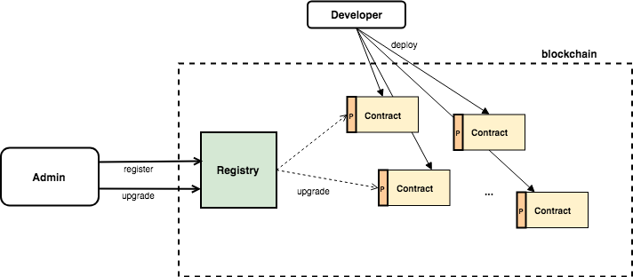

# RayonProtocol Registry Contracts

This is a registry contract project of RayonProtocol. It stores and manages all contract information. Client can get lists and information through registry contract

## About
### Architecture



## Getting Started

### Installing

- clone the repository to your local drive

```
$ git clone https://github.com/rayonprotocol/rayonprotocol-contract-registry.git
```

- install truffle

```
npm install -g truffle
```

- install [ganache](http://truffleframework.com/ganache/) for use of local development node

- install node_module

```
$ npm install 
```

#### Deployment

- deploy smart contracts

```
$ truffle deploy
```

#### Test

- execute test scripts

```
$ truffle test

```

## Built With
* [Truffle](https://truffleframework.com/) - Ethereum Smart Contract Framework
* [Solidity](https://github.com/ethereum/solidity) - Used to develop the Reverse Inquiry smart contracts
* [Node.js](https://nodejs.org/en/) - Server application framework for KYC System

## Acknowledgments
